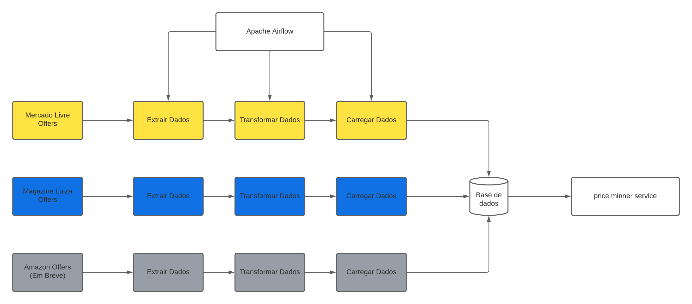

# Automação de ETL de Price Minner Service

## Automação

O Serviço possui um endpoint para cada processo:

- Extrair Dados (Mercado Livre)
- Extrair Dados (Magazine Luiza)
- Extrair Dados (Amazon)(Em Breve)

- Transformar Dados (Mercado Livre)
- Transformar Dados (Magazine Luiza)
- Transformar Dados (Amazon)

- Carregar Dados (Mercado Livre)
- Carregar Dados (Magazine Luiza)
- Carregar Dados (Amazon)

## Objetivo:

Automatizar o processo de extração das ofertas diarias, diariamente. e fornecer uma API atualizada para integrar as ofertas de 3 sites em um unico app.